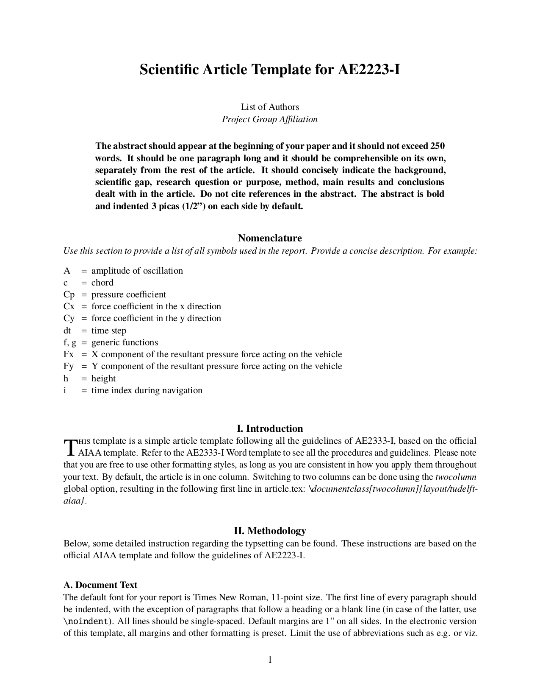
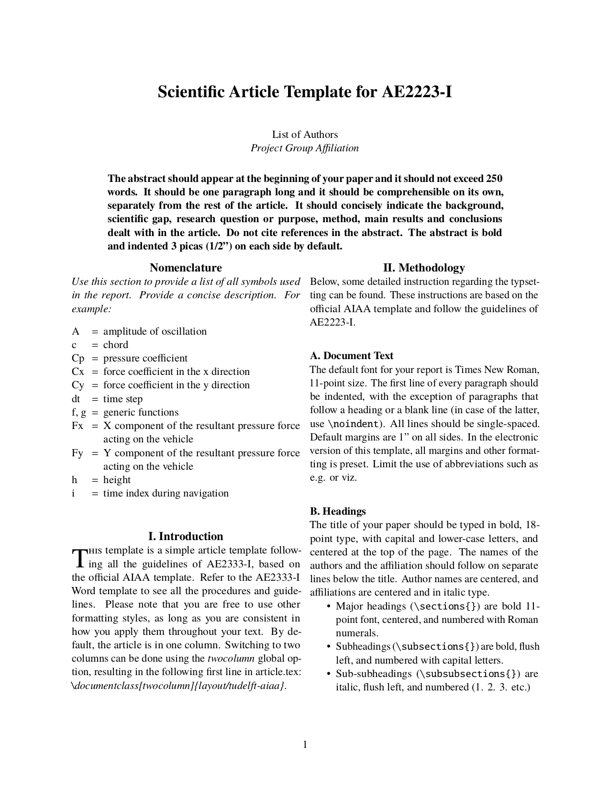

# Preview

This template is a simple article template following all the guidelines of AE2333-I, based on the official AIAA template. Some of the main features:

* **Quick Start:** Many common packages are included by default to get started immediately.
* **Two Columns:** Use one column, or switch to two columns at any time with minimal effort.
* **Extensive Bibliography:** Even for less common types, a sample reference is included to make sure all information is covered.

 

  
  

