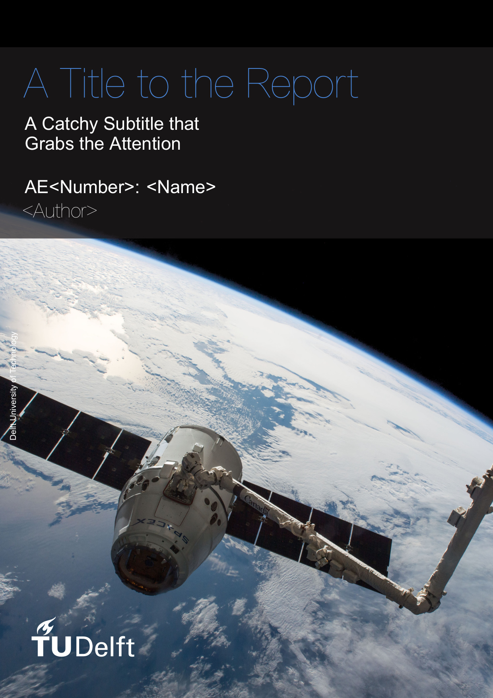
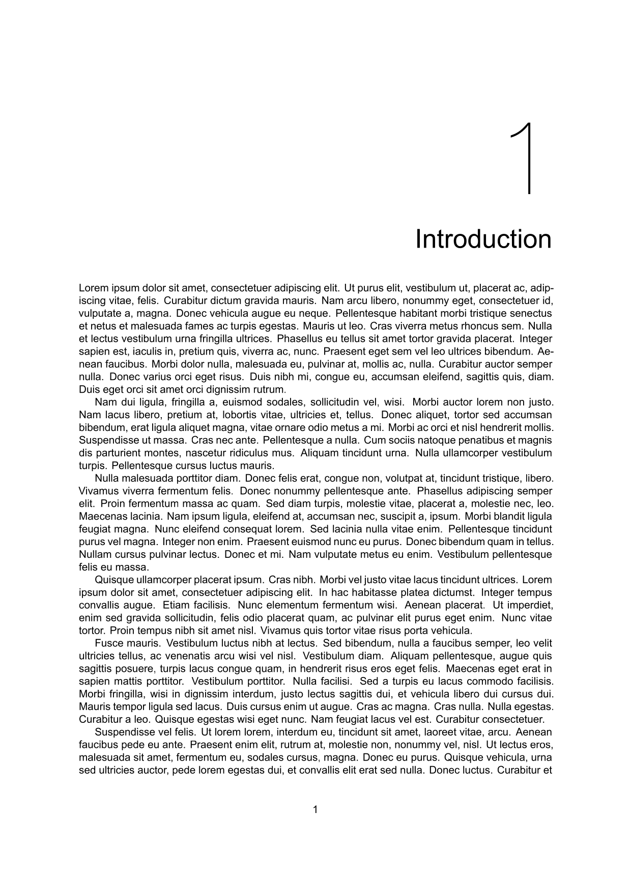

# Report/Thesis Template

<p>
  <a href="https://www.overleaf.com/docs?snip_uri=https://github.com/dzwaneveld/TU-Delft-Unofficial-Report-Template/archive/master.zip&engine=xelatex" target="_blank" rel="noopener noreferrer">
    
  </a>
  <a href="https://github.com/dzwaneveld/TU-Delft-Unofficial-Report-Template/archive/master.zip" >
    
  </a>
  <a href="https://github.com/dzwaneveld/TU-Delft-Unofficial-Report-Template/" target="_blank" rel="noopener noreferrer">
    
  </a>
  <a href="/about">
    
  </a>
</p>

This template aims to simplify and improve the (Xe)LaTeX report template by Delft University of Technology. Some of the main features:

* **Quick Start:** Many common packages are included by default to get started immediately;
* **Simple:** A class file that has been reduced by over 60% to simplify customization;
* **Effortless:** Minor enhancements and features to keep focused on writing, such as a nomenclature that flows over page boundaries automatically.

This template works with _pdfLaTeX_, _XeLaTeX_ and _LuaLaTeX_. In order to adhere to the TU Delft house style, either _XeLaTeX_ or _LuaLaTeX_ is required, as it supports TrueType and OpenType fonts. _BibLaTeX_ is used for the bibliography with as backend _biber_. If you would like to use it on Overleaf, click the button above to get started immediately.

<p align="center">
  
  
</p>

::: tip
On this page, you will find a general outline of the template. If you have specific questions, you might want to visit the [FAQ](/report/faq.html) instead.
:::

## Document Structure

### Global Options

As a report/thesis is generally quite a substantial document, the chapters and appendices have been separated into different files for convenience. All these files are inserted in the master file, `report.tex`, using the `\input{filename}` command. The document class, which can be found in `layout/tudelft-report.cls`, is based on the LaTeX book class. The class currently has one custom option:

- **Twoside**: If this option is specified, the margins and headers are adjusted and whitepages are added to resemble a printed (doublesided) book layout. If the document is not printed, it is recommended to keep using the default option (`oneside`), as any obsolete whitepages will be removed.

The default option can be changed by adding the chosen option to the first line in the master file:

```LaTeX
\documentclass[<option1>,<option2>,...]{layout/tudelft-report}
```

### Structure

Between `\begin{document}` and `\end{document}`, the content is split into three parts by:

- `\frontmatter` uses Roman numerals for page numbering and is only used for the title page, table of contents, nomenclature and list of tables/figures. The title page can be found in `titlepage.tex` and the nomenclature in `nomenclature.tex`. The nomenclature uses *longtables* by default, which allows tables to flow over page boundaries;

- `\mainmatter` uses Arabic numerals for page and chapter numbering. The bibliography is added using `\printbibliography` using the file `report.bib`. See [Section 3](/report/#bibliography) for more details;

- `\appendix` uses letters for the chapter numbering.

## Cover and Title Page

### Information on the Cover and Title Page

The template will automatically generate a cover when the `\makecover` command is used. Before generating the cover, some information has to be specified:

- **Required:** `\title{Title}`, `\author{Author}`, `\coverimage{cover.jpg}`\
These commands specify the title, author and cover image respectively. Try to make the title concise and add more information in the (optional) subtitle. As space is limited, the title page includes a table to specify student names and numbers when working in a larger group. Refer to the [FAQ](/report/faq.html#how-do-i-get-more-authors-on-the-cover-while-staying-organized) if you would like to add a table with author names on the cover.

- **Optional:** `\subtitle{Subtitle}`, `\subject{Course Code: Name}`\
The subtitle and subject are optional. The subtitle has no issues with line breaks and two lines will likely give the best result.

The title, subtitle and author will also be present on the title page. To give greater flexibility over the title page, the layout is described in `title.tex`. Modify this file according to your needs and make sure to check the requirements.

### Included Cover Images

Six high quality cover images related to aerospace engineering have been included. Please make sure to appropriately credit the cover page if you decide to use one of them. A preview can be seen below. A list with the attributions and recommended title color can be found below:

<p align="center">
  
</p>

For the first three images, the title color `4884d6` is recommended:

* `cover1.jpg`: Storm Cell Over the Southern Appalachian Mountains by NASA/Stu Broce under CC BY 2.0
* `cover2.jpg`: Canadarm 2 Robotic Arm Grapples SpaceX Dragon by NASA under CC BY-NC 2.0 // Modified
* `cover3.jpg`: City Lights of Africa, Europe, and the Middle East by NASA Earth Observatory under CC BY 2.0

For fourth, the title color `fe860e` is recommended. For the final two, the title color `e3a01b` is recommended:

* `cover4.jpg`: Royal Air Force Voyager Transport Tanker Aircraft by Ministry of Defense/Cpl Ashley Keates under OGL v1.0
* `cover5.jpg`: Aircraft Flying in the Sunset by Gerhard Gellinger
* `cover6.jpg`: F18 at Bodo Air Base Norway by Ministerio de Defensa España under CC BY-NC 2.0

## Bibliography

The bibliography is added with `\printbibliography` using the file `report.bib` and has been renamed to 'References' using the `title=References` option. If you would like to change the bibliography file, change the command `\addbibresource{report.bib}` in `report.tex` accordingly. Check out [the FAQ](/report/faq.html#how-do-i-change-the-bibliography-style) if you would like to change the bibliography style.

Some examples of common types of references are included. An example of a book entry can be found below. This entry can be cited using `\cite{anderson-introduction-to-flight}`. The command accepts multiple entries, separated by a comma (`\cite{entry1,entry2,...}`).

```LaTeX
@book{anderson-introduction-to-flight,
    Author = {J.D. Anderson},
    Title = {Introduction to Flight},
    Publisher = {McGraw Hill Education},
    Year = {2016},
    Edition = {8th international ed.},
    Address = {New York, United States},
    Note = {}
}
```

Adding most entries will be relatively straightforward, however some uncommon types will inevitably appear at times. Refer to [Section 2.1.1](http://mirrors.ctan.org/macros/latex/contrib/biblatex/doc/biblatex.pdf#subsubsection.2.1.1) of the documentation of BibLaTeX to learn more about the various default types and the fields accepted per type.
