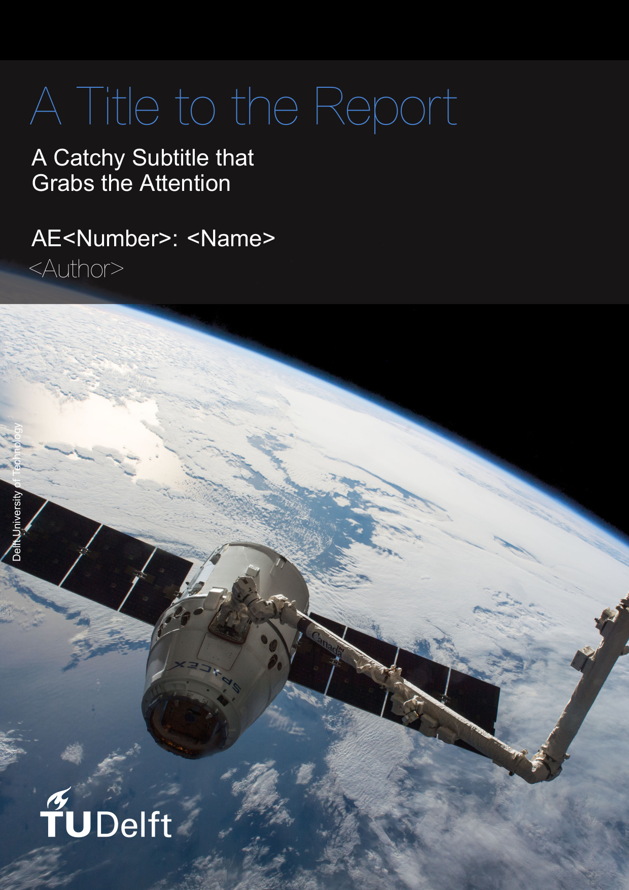

# Preview

This template aims to simplify and improve the (Xe)LaTeX report template by Delft University of Technology. Some of the main features:

* **Quick Start:** Many common packages are included by default to get started immediately.
* **Simple:** A class file that has been reduced by over 60%, making it easy to work with. Make adjustments, or simply stick with the original look.
* **Effortless:** Minor enhancements and features to keep focused on writing instead, such as a nomenclature that flows over page boundaries automatically.

 

  

