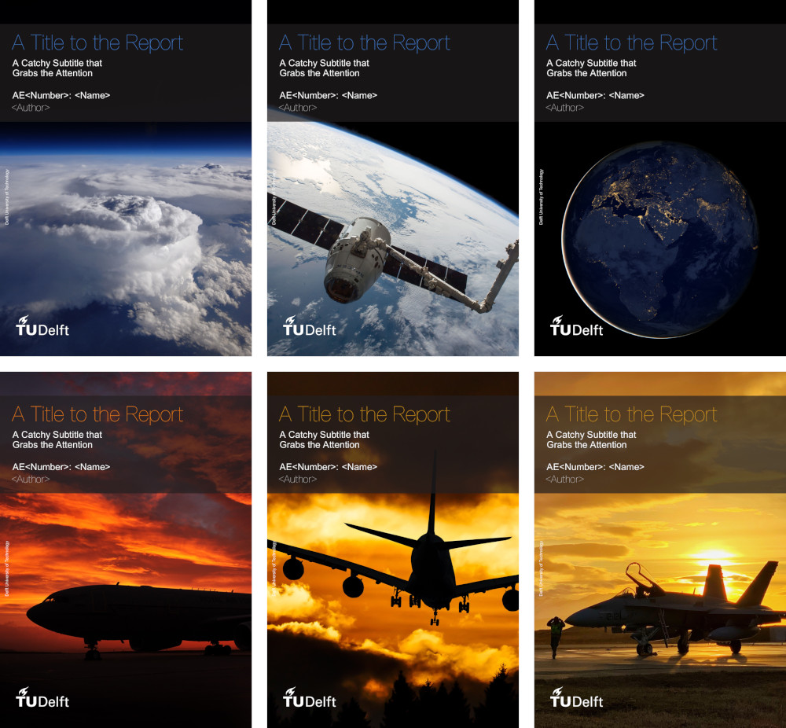

# Getting Started

<p>
  <a href="https://www.overleaf.com/docs?snip_uri=https://github.com/dzwaneveld/TU-Delft-Unofficial-Report-Template/archive/master.zip&engine=xelatex" target="_blank" rel="noopener noreferrer">
    
  </a>
  <a href="https://github.com/dzwaneveld/TU-Delft-Unofficial-Report-Template/archive/master.zip" >
    
  </a>
  <a href="https://github.com/dzwaneveld/TU-Delft-Unofficial-Report-Template/" target="_blank" rel="noopener noreferrer">
    
  </a>
  <a href="/about">
    
  </a>
</p>

This template works with _pdfLaTeX_, _XeLaTeX_ and _LuaLaTeX_. In order to adhere to the TU Delft house style, either _XeLaTeX_ or _LuaLaTeX_ is required, as it supports TrueType and OpenType fonts. _BibLaTeX_ is used for the bibliography with as backend _biber_. If you would like to use it on Overleaf, click the button above to get started immediately.

::: warning
The documentation below describes the option `classic` for a more traditional cover. This feature will be added in the next version, which will be released at a later date. That release will also provide a title page specifically for theses.
:::

## 1. Document Structure

### 1.1 Global Options

As a report or thesis is generally quite a substantial document, the chapters and appendices have been separated into different files for convenience. All these files are inserted in the master file, `report.tex`, using the `\input{filename}` command. The document class, which can be found in `tudelft-report.cls`, is based on the LaTeX book class. The class accepts several comma-separated options:

- **Twoside**: If this option is specified, minor changes the margins and headers are made and whitepages are added to resemble a printed (doublesided) book/report layout. In case the files are not printed, it is recommended to keep using the `oneside` option, as any obsolete whitepages are not present.
- **Classic**: The template has a redesigned cover page, which requires decently high-res image for best results. If you would rather stick with a more traditional cover or have only a smaller figure, the `classic` cover can be used. For more information, see [Section 2](/getting-started.html#_2-cover-and-title-page).

The default option can be changed to the options mentioned above by adding the options to the first line in the master file:

```LaTeX
\documentclass[<option1>,<option2>,...]{layout/tudelft-report}
```

### 1.2 Structure

Between `\begin{document}` and `\end{document}`, the content is split into three parts by:

1. `\frontmatter`, which uses Roman numerals for the page numbers and is used for the title page, table of contents, nomenclature and list of tables and figures. The title page can be found in `titlepage.tex` and the nomenclature in `nomenclature.tex`. The nomenclature uses *longtables* by default, which allows tables to flow over page boundaries;

2. `\mainmatter`, which uses Arabic numerals for the page numbers and is used for the chapters. The bibliography is added using `\printbibliography` using the file `report.bib`. See Section 3 for more details.

3. `\appendix`, which uses letters for the chapters.

## 2. Cover and Title Page

### 2.1 Information on the Cover and Title Page

This template will automatically generate a cover when using the `\makecover` command. Note that two cover styles are present in this template. The default uses a page-filling illustration, whereas the `classic` global option is ideal for smaller figures. See Section 1.2 for more detail about global options. Before generating the cover, some information has to be specified:

- `\title{Title}`, `\subtitle{Subtitle}`\
These command specify the title and subtitle respectively. Make the title concise and add more information in the subtitle. It is recommended to make the subtitle two lines. The subtitle supports linebreaks (\\\\) to fine-tune if desired.

- `\author{Author}`, `\subject{Course Code: Name}`\
The author and course are specified using this command. As space is limited, note that the title page has a table to specify students and number when working in a group. The subject command is optional.

- `\coverimage[Optional Y-Offset]{\includegraphics[width=\paperwidth]{cover.jpg}}`\
This command specifies the cover image. If the `classic` cover is used, the 'y-offset' and 'width=\paperwidth' can be used to shrink and place the image on the cover correctly. The 'y-offset' is measured from the bottom of the page and supports various many units.

The title, subtitle and author will also be present on the title page. To give greater flexibility over the title page, the layout is described in `title.tex`. Modify this file according to your needs and make sure to check the requirements.

### 2.2 Included Cover Images

Six high quality images related to aerospace engineering have been included in this template. Make sure to appropriately credit them, if you decide to use one of them. A preview can be found below, together with the attributions.

<p align="center">
  
</p>

For the first three images, the title color `4884d6` is recommended:

* `cover1.jpg`: Storm Cell Over the Southern Appalachian Mountains by NASA/Stu Broce under CC BY 2.0
* `cover2.jpg`: Canadarm 2 Robotic Arm Grapples SpaceX Dragon by NASA under CC BY-NC 2.0 // Modified
* `cover3.jpg`: City Lights of Africa, Europe, and the Middle East by NASA Earth Observatory under CC BY 2.0

For fourth, the title color `fe860e` is recommended. For the final two, the title color `e3a01b` is recommended:

* `cover4.jpg`: Royal Air Force Voyager Transport Tanker Aircraft by Ministry of Defense/Cpl Ashley Keates under OGL v1.0
* `cover5.jpg`: Aircraft Flying in the Sunset by Gerhard Gellinger
* `cover6.jpg`: F18 at Bodo Air Base Norway by Ministerio de Defensa España under CC BY-NC 2.0

## 3. Bibliography

The bibliography is added using `\printbibliography` using the file `report.bib` and has been renamed to 'References' using the `title=References` option. If you would like to change the default bibliography file, change the command `\addbibresource{report.bib}` accordingly, which can be found in the class file.

Some examples of common types of references can be found in the bibliography file. Remember that, especially articles, often have 'cite using BibTeX' available. An example of a book entry can be found below. In this case, the entry can be cited using `\cite{anderson-introduction-to-flight}`. This command accepts multiple entries, separated by a comma (`\cite{entry1,entry2,...}`).

```LaTeX
@book{anderson-introduction-to-flight,
    Author = {J.D. Anderson},
    Title = {Introduction to Flight},
    Publisher = {McGraw Hill Education},
    Year = {2016},
    Edition = {8th international ed.},
    Address = {New York, United States},
    Note = {}
}
```

Adding most entries will be relatively straightforward, however some uncommon types will inevitably appear at times. Refer to [Section 2.1.1](http://mirrors.ctan.org/macros/latex/contrib/biblatex/doc/biblatex.pdf#subsubsection.2.1.1) of the documentation of BibLaTeX to learn more about the various default types and the fields accepted per type.
